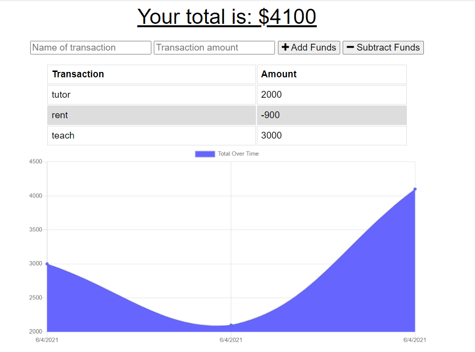

# 15_Progressive_Budget

* [Acceptance Criteria](#acceptancecriteria)
* [Installation](#installation)
* [Project Status](#projectstatus)
* [License](#license)
* [Deployment](#deployment)
* [Usage](#usage)
* [Preview of the App](#previewApp)

# User Story
AS AN avid traveller
I WANT to be able to track my withdrawals and deposits with or without a data/internet connection
SO THAT my account balance is accurate when I am traveling

# Business Context

Giving users a fast and easy way to track their money is important, but allowing them to access that information anytime is even more important. Having offline functionality is paramount to our applications success.

# Acceptance Criteria
GIVEN a user is on Budget App without an internet connection
WHEN the user inputs a withdrawal or deposit
THEN that will be shown on the page, and added to their transaction history when their connection is back online.

# Installation
In order to use this app, you will need to use the Mongo database with a Mongoose schema.

# Project Status
This project was completed on June 5, 2021. 

# License
MIT

# Deployment
[Link](https://pwa-budget-obi.herokuapp.com/)

# Preview of the App
* This is how the app looks
